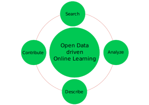

# ODDOL
**Open Data Driven Online Learning**

ODDOL is an open platform that enables online learners to make use of open datasets for their projects and assignments. Users can search open datasets, use and analyze them for their projects, describe their results, and optionally contribute new datasets from their results.

## Problem
Data is being released with open licenses around the world. The use of open data is the founding block for transparent data-driven decisions. However, its usage for online learning is quite limited. Most of our current online learning approaches make use of some pre-fabricated data. They may help explain some topics, but the students and online learners learn very little about the real social and economic potential impacts from these prepared datasets. Therefore, online learning must be driven by open datasets.

Secondly, even if some open datasets are used by a small group of researchers, their usage may not be known to other online learners. It is essential to know the purpose, usage, and the results obtained by the data analysis. Not only will this help the online instructors to prepare and improve their courses with interesting real-life use cases but also help other researchers to verify as well as improve already improved research works. These data sources need to be made easily findable. Therefore they need to be curated considering the choice of licenses, purpose, use, etc.

Finally, there must be a possibility to contribute and curate new datasets obtained from the data analysis results as well as new experimental results.

## Solution: ODDOL

**ODDOL** revolves around four principles for making the best use of open data.
* Search
* Analyze
* Describe
* Contribute

It helps the users search the datasets based on the license, help them analyze their existing purpose and use, use them for their projects, describe their use in their projects as well as help them contribute in the form of curation of new experiment datasets and results.
