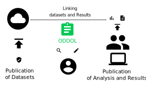

# Architecture

This page explains the current approach related to publication of datasets as well as their analysis done by the researchers before explaining the role of ODDOL in online learning.

## Current Approach
Currently organizations periodically release datasets for public consumption with open licenses. These datasets may consist of aggregated information or fine-detailed information, like for example, the detailed daily temperature and humidity reports. These datasets are studied and analyzed by researchers and if they find interesting and relevant information, they may publish these results in the form of scientific articles. But these datasets may also be used by policymakers for decision making.

During this process of analysis, scientists and policy makers make use of several algorithms for filtering, cleaning, analyzing and visualizing these data. In some cases, the complete code for this analysis may not be publicly available, but they may be just briefly mentioned in the articles. These information are not currently easily available to the online learning community.

There is need to document these information and let online learners see the potential benefits of various algorithms, techniques and tools on the different types of datasets. 

## ODDOL
The goal of ODDOL is to link the datasets and the results, i.e., the ODDOL is an open platform that links all the major information related to published results, articles and public documents to the original dataset.

### Linking datasets and published documents
Following are some of the major information that can be used to link the two:
* License of dataset
* Publisher of dataset
* Funding agency or sponsor behind the published datasets and results
* URL of the dataset and published document
* Data format used by the dataset
* Main subjects of the dataset as well as the published result
* Purpose behind use of dataset in the published document
* Works cited by the datasets (including other datasets)

### How to obtain these information
There are two ways by which these information can be obtained
* Curation by community members
* Automated annotation of published documents

### Where to store these information
Since these information are curated by the online learning community, it is important that the community members can make use of these information locally and even add additional information in their local instances.

ODDOL is not limited to any particular platform. Therefore it can also be integrated with open data stores like Wikidata or Wikibase instances.

## Credits
* [Icons](https://material.io/resources/icons/?icon=bubble_chart&style=baseline)
