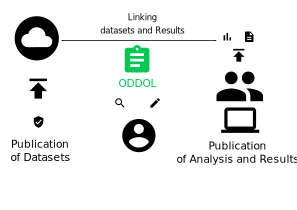

# ODDOL Problem Overview and Vision

This page explains the motivation behind ODDOL before the implementation-level architecture.

## Current Approach

Organizations periodically release open datasets for public consumption under open licenses.  
These datasets can include aggregated values or highly detailed observations (for example, daily temperature and humidity records).  
Researchers, policy makers, and analysts apply filtering, cleaning, modeling, and visualization workflows to derive conclusions.

A recurring issue is that the complete analysis workflow is not always available in a reusable form.  
In many publications, methods are summarized briefly, while code, query logic, tool configurations, and intermediate data transformations are not fully documented.

As a result, online learners often see final conclusions but not the full path from dataset to result.

## Why ODDOL

ODDOL addresses this gap by linking datasets, analysis context, and published outputs in a learner-oriented workflow.

The objective is to make it easier to:

- discover relevant datasets and related documents,
- inspect key metadata and provenance links,
- run and document analyses in a reproducible way,
- export learning artifacts that include sources and methods.

## Linking Datasets and Published Documents

Examples of linkage signals:

- dataset license
- dataset publisher
- funding organization/sponsor
- dataset and publication URLs
- data format
- domain topics/subjects
- purpose of use in the publication
- cited/related works and datasets

## Data Models

Open models for key concepts are available on Wikidata:

- [Dataset EntitySchema:E207](https://www.wikidata.org/wiki/EntitySchema:E207)
- [SPARQL endpoint EntitySchema:E208](https://www.wikidata.org/wiki/EntitySchema:E208)
- [API endpoint EntitySchema:E209](https://www.wikidata.org/wiki/EntitySchema:E209)

## How These Links Can Be Obtained

Two complementary approaches:

- curation by community members
- automated annotation/extraction from publications

## Where to Store These Links

Because community members may want local reuse and extension, ODDOL is not tied to a single storage platform.

ODDOL can integrate with open knowledge/data ecosystems such as:

- Wikidata
- Wikibase instances
- other open data services

## Credits

- [Icons](https://material.io/resources/icons/?icon=bubble_chart&style=baseline)
